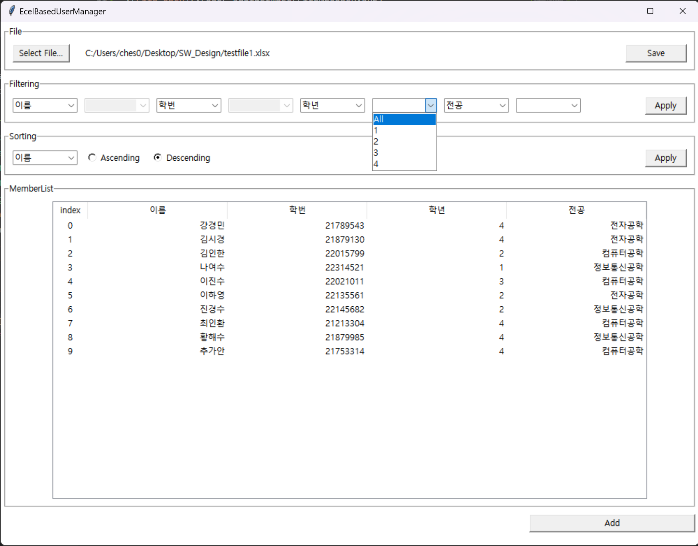

# SW_Design
This program provides Excel based User management. Using the program, you can easily and conveniently manage the user list by utilizing Excel data for the existing user list. 
## User's Guide

### 0. Excel Data Format
Basically, Excel file has required formatting. Let the data start at row 1 and column A. like this

### 1. Open File
First, you need to open an Excel file to manage. The buttons that function can be found at the top left.

### 2. Filtering
When you open a file, the filtering function is set in the order of the lower columns. If you want to see specific properties of users, select properties from the filtering frame and press the Apply button.

In addition, if the range of values is limited for a particular property (ex gender: male, female), filtering can also be performed for that value

### 3. Sorting
You can sort on the user data displayed on the screen in Sorting frame. First, select the property to be the sort criteria, select ascending and descending order, and then press the Apply button.

### 4. Show User info
If you want to see all the information about a particular user, double-click the user in the list. This opens a new window and prints all the information for that user.

### 5. Edit & Delete
You can proceed with deletion or editing in a window that prints the user's details. When deleted, the user's data is deleted from the list, and when edited, a new window opens to proceed with the editing.

### 6. User Add
If you press the Add button on the bottom left of the screen, run Add User. At this point, a window opens to receive the information of the added user.

### 7. Save
To save your changes, press the Save button located at the top right of the screen.

